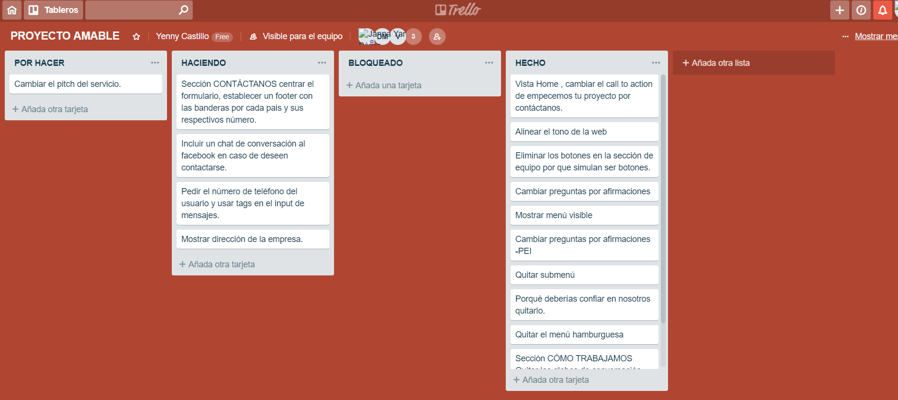
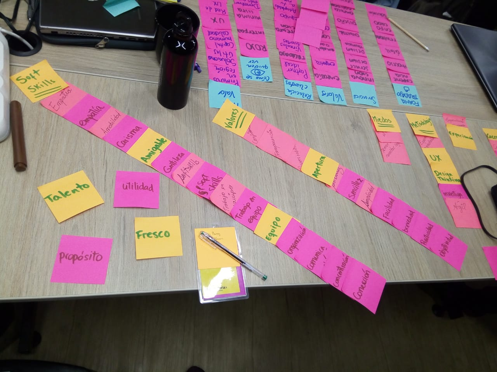
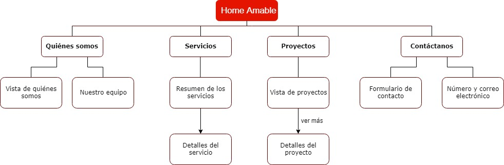
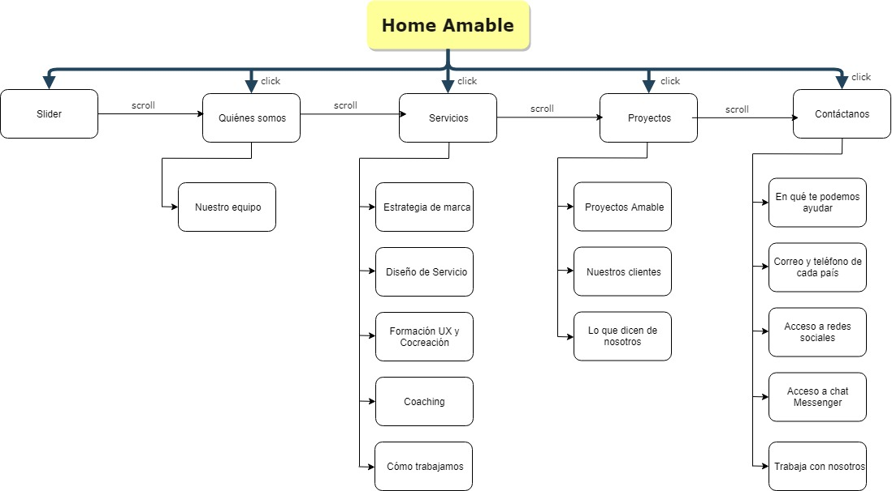
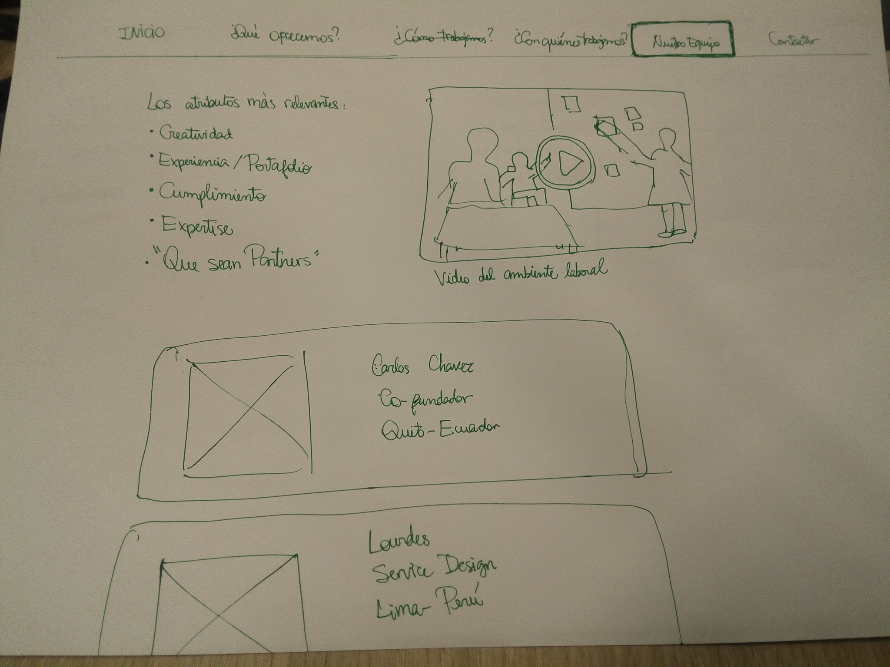
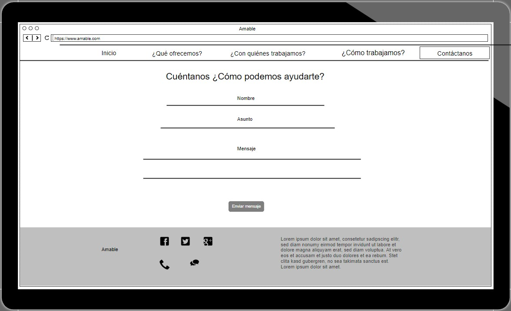
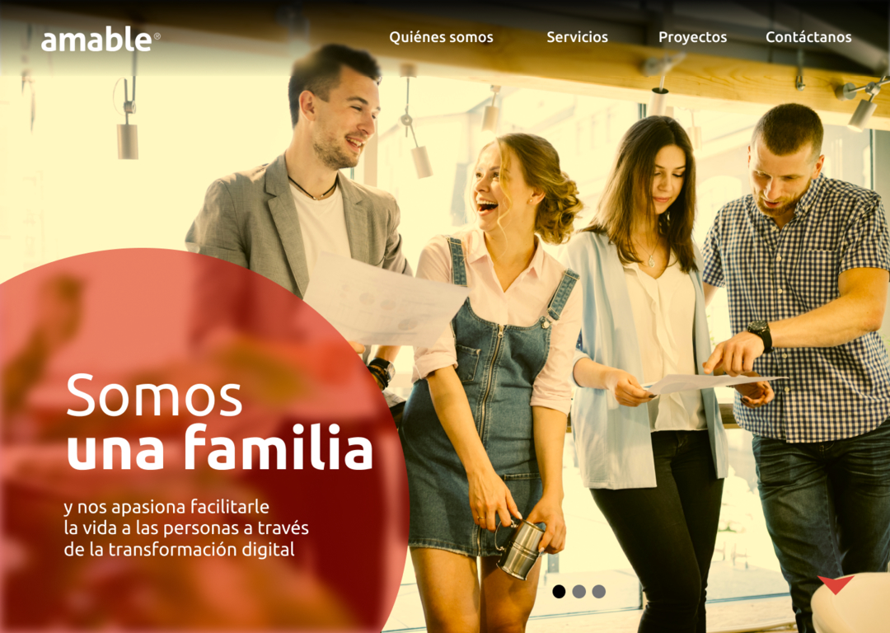

# Rediseño de la web corporativa de Amable

## Preámbulo

[Amable](http://www.amable.com/) es una empresa consultora de Diseño de Experiencia de
Usuario con  presencia en Chile, Ecuador, Perú y Argentina.

La web corporativa [(www.amable.com)](http://www.amable.com/) requiere una actualización
de emergencia debido a que la versión anterior fue recientemente dada de baja por un crackeo
del servidor. La versión actual es un "parche" temporal rápido, hecho en un par de días,
y que solamente muestra un resumen de lo que es Amable.
 
## **Contexto** 

Nosotras como UX Designers recibimos el proyecto para elaborar el rediseño de la página web de la Consultora UX **Amable**. 

La misma empresa ya había empezado el proceso y nos brindó el research logrado hasta el momento. (Se puede [visualizar en este documento](https://drive.google.com/open?id=1EbRswuGeG3Of9hDj5BeM7NVaiOAeS-h4))

Con esta información, empezamos a familiarizarnos más con la empresa y su visión. 

## **Planificación**

Identificamos las tareas principales y nos organizamos para distribuirlas entre cada miembro del equipo. Utilizamos un tablero en Trello.

[Link a Trello](https://trello.com/b/KNXNrnIG/proyecto-amable)

## **Investigación**

Amable tenía establecidos sus propósitos principales: transmitir lo que es Amable realmente y dar a entender lo que ofrecen.

Asimismo, tenían establecido su público meta: empresas ya consolidadas, socios de negocio, mercados nuevos y colaboradores potenciales, en ese orden de prioridad.

Habían realizado entrevistas a usuarios potenciales de la web. Fueron 15 entrevistas a personas representativas de su público meta. Como resultado hicieron un ejercicio de descarga colectiva para poder sacar insights y ver las similitudes de las opiniones de los entrevistados.

También elaboraron dos User Personas y el Journey Map enfocado en potenciales clientes.

Hicimos un benchmark a distintas webs para comparar y analizar empresas que se encuentran en el mismo rubro. ([Conclusiones del benchmark](https://drive.google.com/open?id=1DqXPq646cabi-48fwXXCbf60nykT0mIOSomOjzPP3Xk))

## **Definición** 

Realizamos el trabajo de conceptualización junto con Amable, para sintetizar qué valores definen a la empresa. También hicimos el ejercicio de definir un personaje que represente a Amable y concluimos que la que más se aproxima es Wendy Ramos. La elegimos por ser una emprendedora peruana que es camaleónica, se adapta a los cambios, tiene mucha empatía y trabaja con entrega y corazón.

## Mapa de navegación

Para organizar la web utilizamos un mapa de navegación como representación esquemática de su estructura para facilitar y orientar el recorrido por la misma.

## Diagrama de flujo

Hicimos un diagrama de flujo para representar el proceso de la web.

## **Prototipado**

En la etapa de prototipado empezamos con algunos sketches para idear la solución.

## Wireframes

Después de tener una idea más sólida, proseguimos a elaborar los wireframes para tener una visión más clara.

[Link a wireframes](https://drive.google.com/open?id=1uTTGIVTyair_CjP6kVvylsBDdK2DLI6w)

## Prototipo de Alta fidelidad (con iteración)

Elaboramos un prototipo de alta fidelidad para luego testearlo e iterarlo. Como resultado de ello, tenemos el siguiente prototipo interactivo.

[Ingresa al prototipo interactivo](https://www.figma.com/proto/TFAyGetNT9M6HLdxmSv8i1fI/WEB-AMABLE?node-id=44%3A0&scaling=scale-down)

## Testing

Con la primera versión del prototipo de alta fidelidad testeamos a 4 usuarios. 

Estos usuarios tuvieron problemas en entender el flujo de la web, no encontraban fácilmente lo que buscaban. A primera vista les parecía que no era una web sino una presentación con slides. Los que veían la información del equipo de Amable, querían saber un poco más de la experiencia de cada uno. También pensaban en que daban muchos pasos para llegar a sus objetivos en el menú, ya que en la primera versión había un menú hamburguesa para acceder a las diversas secciones. 

Quitamos una parte de la primera vista ya que los usuarios pensaban que eran botones, pero en realidad no lo eran. Además lo que quería mostrar Amable era claridad en sus servicios, hacer entender a sus clientes qué es lo que hacen de forma sencilla; así que, la implementamos en otra sección. También en la explicación de _cómo trabajan_, las personas testeadas decían que no necesitaban ver tantos videos que cuenten cómo trabajan en la empresa, por eso lo cambiamos para que solo aparezca uno que muestre cómo es su proceso de trabajo, tal como lo deseaba Amable.

Y en la sección de Contáctanos dijeron expresamente: “Dejaría mi número para que me llamen directamente a que escriba un correo” y “me gustaría que tenga tags para seleccionar opciones de contacto”. Por lo que decidimos implementar la opción de tags y de dar el número o correo electrónico, según decida el usuario.

[En este link de la presentación](https://drive.google.com/open?id=1u11gTMHkBsN6uXyzTq1-CTCaMQU5ae-XykuGLYia1HA) se puede visualizar las diferencias entre el primer prototipo y el que se iteró.

Luego de iterar esa primera versión, hicimos testing con 2 personas para validar algunos detalles. Hicimos algunos cambios como segunda iteración.

## **Recursos**

## Zeplin

[Link a proyecto en Zeplin](https://zpl.io/a8P79GX)

## Carpeta Google Drive

[En esta carpeta](https://drive.google.com/open?id=1cTm6pnYtnnt298XRKbbN3Um2uh3oB6E0) se encuentran todos los documentos del proyecto.

